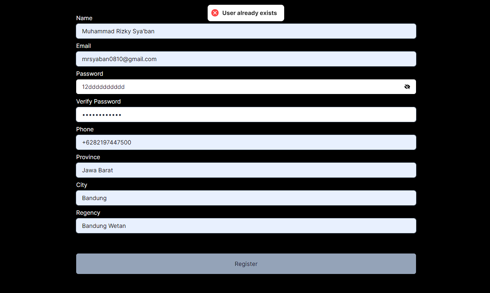
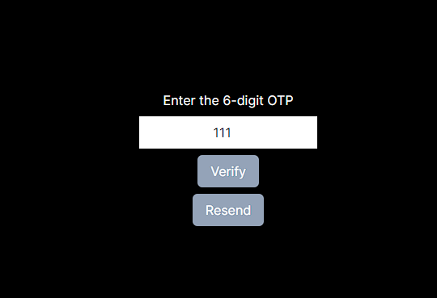
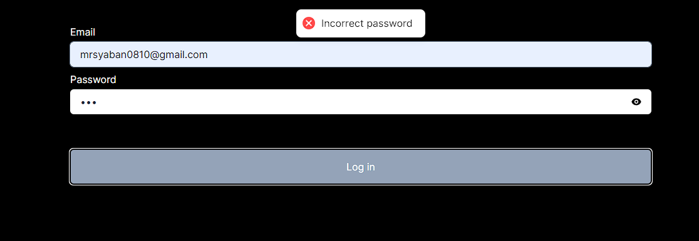

<h2 align="center">
  OTP phone Verification <br/>
</h2>
<hr>

> part of MOC Millenial Indonesia Internship test

## Table of Contents
- [Table of Contents](#table-of-contents)
- [Technologies Used](#technologies-used)
- [Setup](#setup)
- [Usage](#usage)
- [Documentation](#documentation)
- [](#)


<a name="technologies-used"></a>

## Technologies Used
- npm 10.2.2
- next.js
- mongodb

<a name="setup"></a>

## Setup
You can setup your project by cloning this repository and install the libraries above.

```bash
npm i
```

<a name="usage"></a>

## Usage
You can run the server by using the command below on your local.
1. add `.env` from the author 
2. run:

```bash
npm run dev
```

<a name="documentation"></a>

## Documentation
<h3 align="center">signup</h3>



<h3 align="center">verify otp</h3>



<h3 align="center">log in</h3>



<a name="contact"></a>

| Nama                  | Email                       |
| --------------------- | --------------------------- |
| Muhammad Rizky Sya'ban| 13521119@std.stei.itb.ac.id |
## 
<h4 align="center">
  Created by @Rizky<br/>
  2024
</h4>
<hr>
